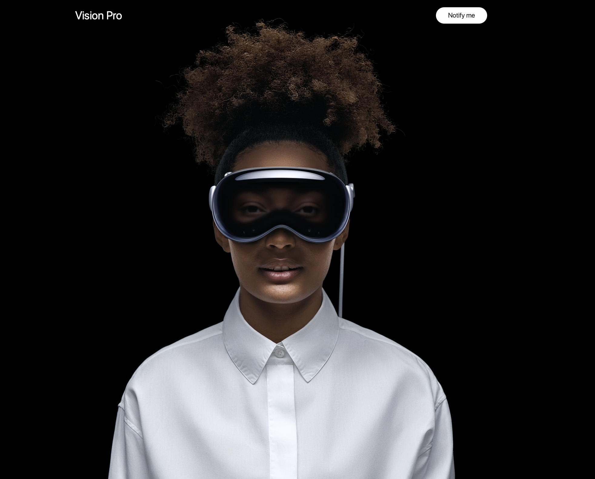
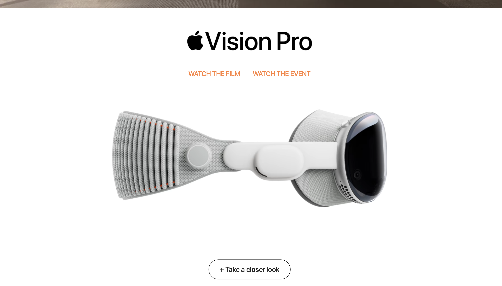
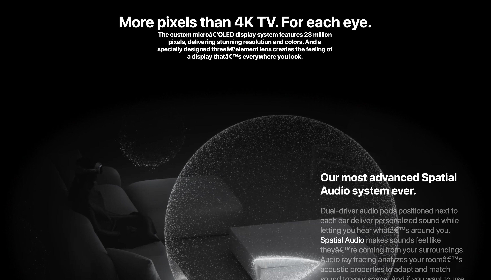

# Vision Pro Web Experience

A high-fidelity front-end recreation of the Apple Vision Pro landing experience.  
This project was built as a UI/UX and animation study to practice modern layouts, smooth interactions, and responsive design using vanilla web technologies.


## Live Demo
> (Optional but highly recommended)  
Add your deployed link here once hosted via GitHub Pages / Netlify / Vercel.


## Project Highlights

- High-fidelity landing page recreation inspired by Apple Vision Pro
- Clean typography, spacing, and layout alignment
- Smooth scroll-based sections and visual transitions
- Fully responsive design across desktop and smaller screens
- Minimal, readable, and well-structured front-end code
- Performance-friendly assets and layout flow


## Tech Stack

- HTML5
- CSS3
- JavaScript (Vanilla)


## Screenshots

### Hero Section



### Product Overview



### Immersive Experience Section



## Folder Structure

```

Vision-Pro-Web-Experience/
│
├── screenshots/       
├── Media/             
├── Canvas VP/          
│
├── index.html          
├── style.css           
├── script.js        
├── README.md         
└── .gitignore

````


## Getting Started (Run Locally)

1. Clone the repository
   ```bash
   git clone https://github.com/your-username/Vision-Pro-Web-Experience.git


2. Open the project

   * Simply open `index.html` in your browser
     **OR**
   * Use VS Code Live Server for best experience
     


## Learning Outcomes

* Improved understanding of modern UI/UX layout principles
* Hands-on practice with spacing, typography, and visual hierarchy
* Experience recreating premium product marketing pages
* Better structuring of front-end projects for readability and scalability


## Disclaimer

This project is created for **educational and portfolio purposes only**.
Apple, Apple Vision Pro, and related branding are trademarks of Apple Inc.
This project is **not affiliated with or endorsed by Apple**.
